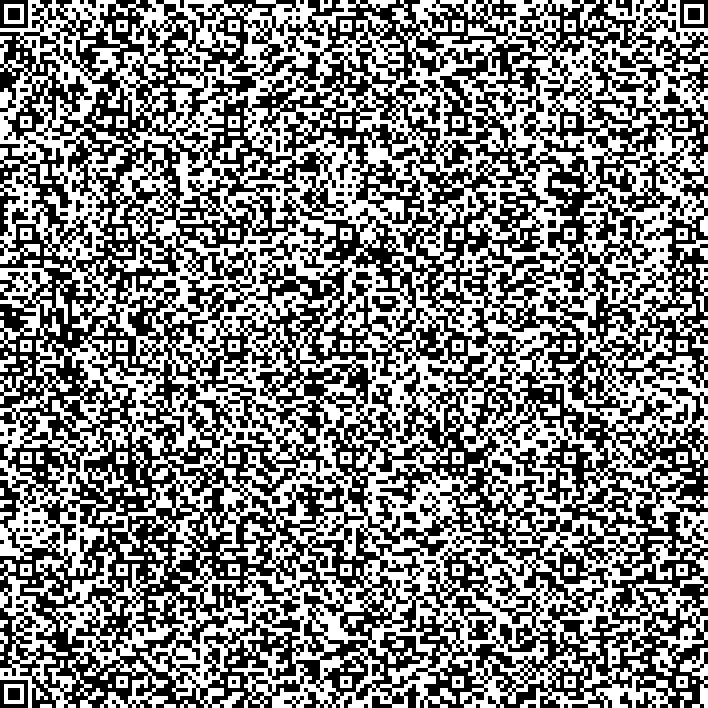

# ◲ QR Clicker
QR Clicker is a Cookie Clicker clone that was made to fit on a QR Code. That means that the entire game is less than 3KB in size. QR Clicker has 6 different buildings, starting at a handheld scanner and slowly getting more complex and more efficient. 

Right now there are two different versions: the one on the QR Code, and the one hosted on my website. The one on the QR Code is a dataURI encoded in Base64, so you can play it by just pasting the dataURI into the searchbar. The one on my website is only different in that it has localStorage functionality, meaning that your progress is saved after closing the tab. 

Below is the QR Code, which is not a link, but the raw binaries. If you don't want to get the game from the QR Code, you can play it [here](https://kolin63.com/apps/qrclicker).

Made for the 2025 Say Cheese event in Hack Club. 
